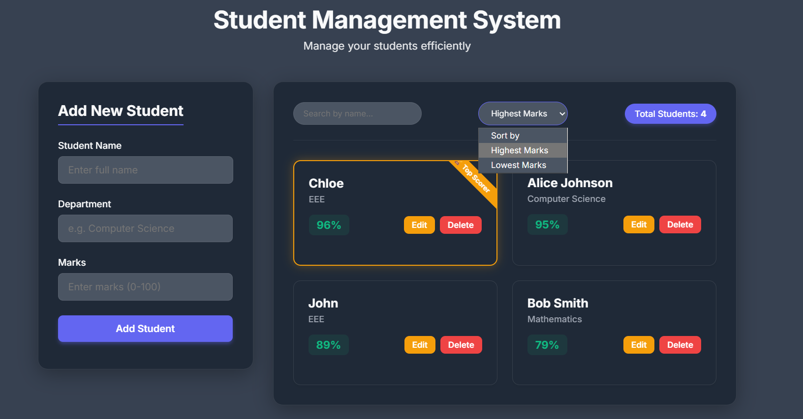

# Student Management System (JavaScript)

A modern, responsive Student Management System built with JavaScript, CSS, and HTML. This project enables educational institutions or administrators to efficiently manage student records, track performance, and organize relevant activities via a sleek web interface.

## Features

- View, add, edit, and delete student records
- Search and filter students by name, ID, or class
- Track grades and class performance
- Manage schedules and academic events
- Responsive and clean UI for seamless user experience

## Screenshot



## Demo

Try out the live demo: [Student Management System Demo](#)  

## Installation

1. **Clone the repository:**
    ```bash
    git clone https://github.com/Radha-7git/Student-Management-System_JS.git
    cd Student-Management-System_JS
    ```
2. **Open the Main App:**
    - Open `index.html` in your browser.
    - No build tools or backend required for the basic JS/CSS/HTML version.

## Technologies Used

- **JavaScript** — core application logic
- **CSS** — modern, responsive user interface
- **HTML** — semantic structure

## Folder Structure

```
Student-Management-System_JS/
│
├── image.png         # Screenshot
├── style.css         # Stylesheets
├── script.js         # JavaScript files
├── index.html        # Entry point
└── README.md         # Documentation
```


**Made with ♥ by [Radha-7git](https://github.com/Radha-7git)**
